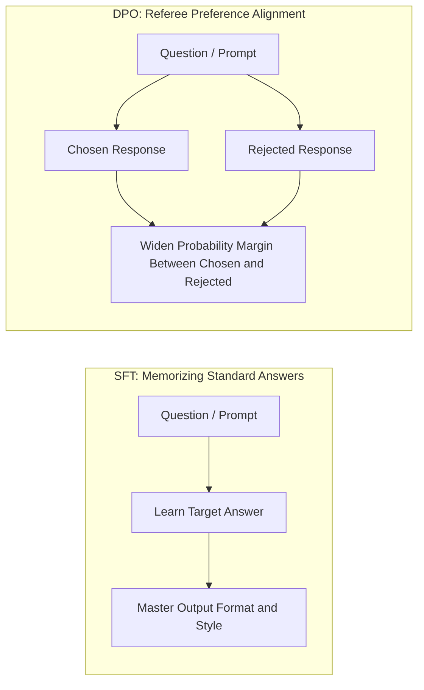
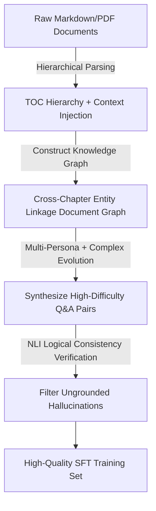
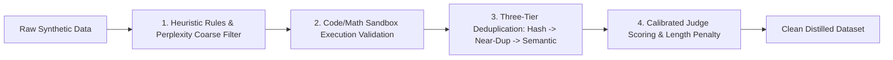
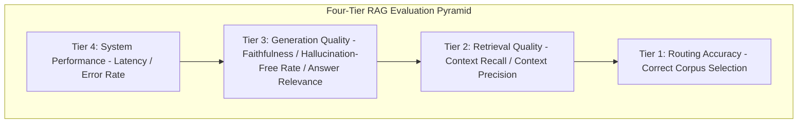
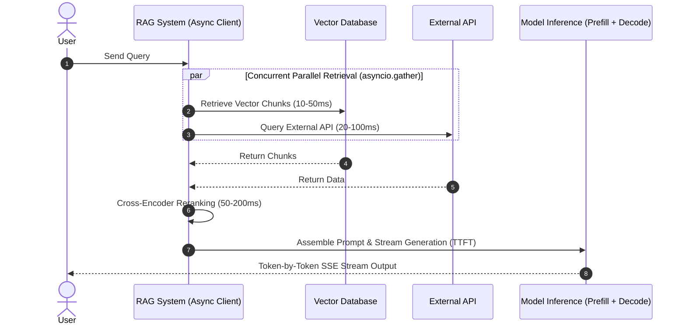
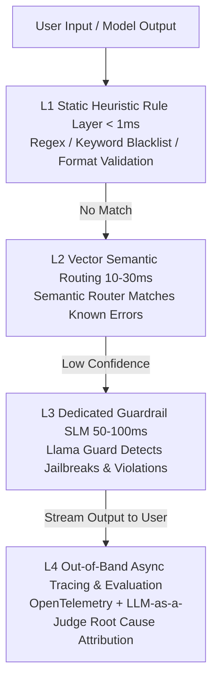
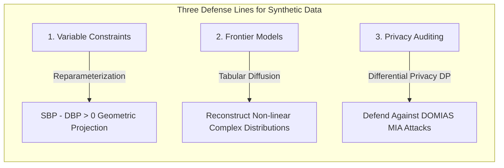
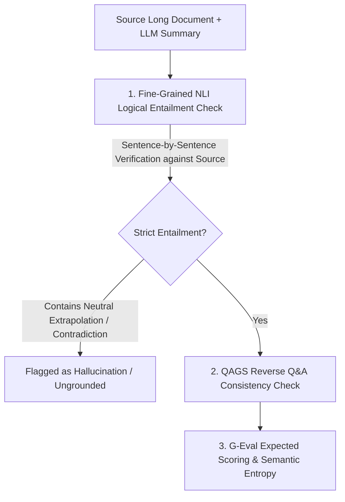
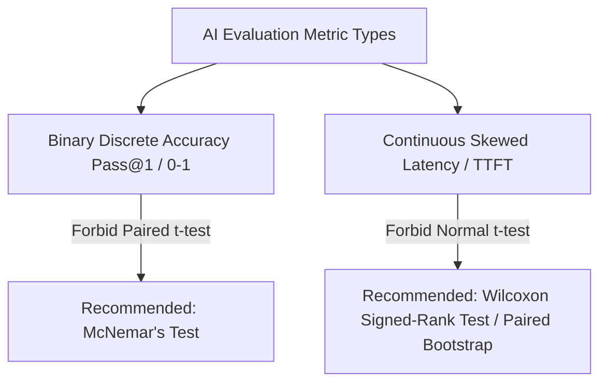
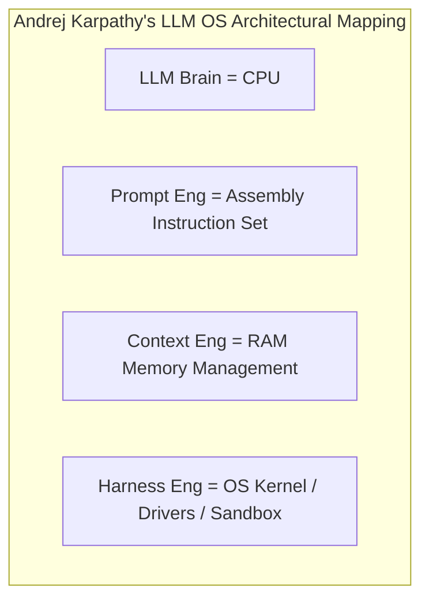

This article provides an in-depth breakdown and architectural reconstruction of **12 core technical questions** spanning large language model fine-tuning, evaluation frameworks, RAG systems, synthetic data generation, statistical validation, and AI infrastructure, utilizing **intuitive analogies, clear Mermaid architectural flowcharts, and foundational intuition**.

---

# I. Technical Question List

1. **LLM Fine-Tuning (SFT vs. DPO)**: How do the working mechanisms of SFT and DPO differ? Why might transitioning from SFT to DPO yield marginal or negligible improvements in domain-specific Q&A scenarios?
2. **Teacher Model-Based Synthetic Q&A Generation**: How can a Teacher Model (such as GPT-4) be leveraged to automatically synthesize high-quality Q&A training datasets from enterprise internal websites and documentation?
3. **Quality Assurance and Filtering for Synthetic Datasets**: How do you validate and filter synthetic data generated by a Teacher Model? What automated and human verification frameworks exist?
4. **Multi-Source Evaluation Dataset Design and Statistical Validation (Bootstrapping)**: How should an evaluation dataset be designed for a multi-source RAG / AI assistant? How can Bootstrap resampling be utilized to measure metric confidence intervals and stability?
5. **RAG Latency Pipeline Breakdown and Concurrency Optimization (Async/Await)**: What stages constitute the latency of a multi-source RAG system? How can sequential requests be optimized into `async/await` concurrent requests? How should sporadic latency spikes and performance jitter be diagnosed?
6. **Chatbot Failure Mode Taxonomy and Hybrid Classification Pipeline**: How do you establish a comprehensive taxonomy for Chatbot failure modes? How can heuristic rules/regex be combined with LLMs to build a high-precision, high-coverage hybrid classification pipeline?
7. **Variable Correlation Handling and Model Selection in Synthetic Tabular/Clinical Data Generation**: When synthesizing tabular data, how do you handle inter-variable correlations and domain constraints? Why choose synthetic data over real-world data?
8. **Output Accuracy Verification in Text Summarization and Information Extraction**: In the absence of ground truth or under prohibitive human review costs, how can the factual accuracy of LLM summaries and extractions be measured and validated?
9. **Empowering AI Model Evaluation and Data Quality Management with Statistics**: How do statistical methods (e.g., Bootstrap, imputation, hypothesis testing) empower engineers to move beyond single point estimates and elevate the rigor of LLM evaluation and data processing?
10. **LLM A/B Comparative Evaluation Framework Design (Model Evaluation Design)**: How do you design a rigorous and trustworthy LLM A/B comparative evaluation framework? What variables must be controlled, and what evaluation dimensions should be adopted?
11. **Differences Among Prompt Engineering, Context Engineering, and Harness Engineering**: What do these three paradigms represent conceptually and practically? What are their respective core responsibilities?
12. **Architectural Relationships Among LLMs, AI Agents, and Agent Harnesses**: How do you describe the architectural relationships and collaborative dynamics among the LLM, the AI Agent, and the Harness framework?

---

# II. In-Depth Answers to Core Technical Questions

---

### Question 1: How Do the Working Mechanisms of SFT and DPO Differ? Why Might Transitioning from SFT to DPO Yield Marginal Improvements in Domain-Specific Q&A Scenarios?

💡 **One-Sentence Intuition**:
* **SFT (Supervised Fine-Tuning)** is like "**memorizing textbook practice questions with standard answer keys**"—the teacher provides the question and the standard answer, and you memorize the output format, tone, and syntax.
* **DPO (Direct Preference Optimization)** is like "**a referee adjusting preferences via pairwise scoring**"—the teacher no longer provides standard answers, but instead takes two student submissions and tells you "A is better than B," guiding you to adjust tone, stylistic preferences, and refusal boundaries.



#### 1. Comparative Analysis of Working Mechanisms
* **SFT (Supervised Fine-Tuning)**:
  * **Mechanism**: Operating on `<Instruction, Response>` structured pairs, SFT performs gradient updates on model parameters via an autoregressive cross-entropy loss function:
    $$\mathcal{L}_{\text{SFT}}(\theta) = -\mathbb{E}_{(x, y) \sim \mathcal{D}} \left[ \sum_{t=1}^T \log \pi_\theta(y_t \mid x, y_{<t}) \right]$$
  * **Intuitive Role**: Teaches the model to adapt to target output structures and stylistic conventions. However, empirical studies (e.g., *Gekhman et al., EMNLP 2024*) demonstrate that core factual knowledge is primarily acquired during pretraining; **SFT cannot effectively inject brand-new factual knowledge absent from the pretraining corpus**. Forcing SFT to memorize unfamiliar factual assertions lacking prior representation readily induces severe **Hallucination Inflation**.
* **DPO (Direct Preference Optimization)**:
  * **Mechanism**: DPO (*Rafailov et al., NeurIPS 2023*) reparameterizes the KL-divergence-constrained preference optimization objective under the Bradley-Terry preference model, enabling the partition function $Z(x)$ to cancel out analytically. This eliminates the necessity of training an explicit Reward Model and avoids the sampling instability of PPO reinforcement learning:
    $$\mathcal{L}_{\text{DPO}}(\theta; \pi_{\text{ref}}) = -\mathbb{E}_{(x, y_w, y_l) \sim \mathcal{D}} \left[ \log \sigma \left( \beta \log \frac{\pi_\theta(y_w|x)}{\pi_{\text{ref}}(y_w|x)} - \beta \log \frac{\pi_\theta(y_l|x)}{\pi_{\text{ref}}(y_l|x)} \right) \right]$$
  * **Intuitive Role**: Amplifies the probability margin between superior responses (Chosen) and inferior responses (Rejected), modulating safety boundaries and refusal behaviors.

#### 2. Root Causes of Marginal Improvements from SFT to DPO in Domain-Specific Q&A
1. **Knowledge Bottleneck**: DPO merely re-weights existing prior probability mass; it cannot synthesize factual knowledge out of thin air. If the model failed to absorb proprietary domain facts during SFT, DPO cannot synthesize accurate factual answers.
2. **"The More Aligned, the More Timid" (Likelihood Displacement)**: Recent research (*Razin et al., ICLR 2024*) shows that when DPO suppresses the probability of Rejected tokens $y_l$, it frequently causes the **absolute log-likelihood of Chosen tokens $\pi_\theta(y_w)$ to degrade concurrently**. In domain-specific Q&A, Chosen and Rejected answers share substantial specialized terminology; penalizing $y_l$ inadvertently damages the generation probabilities of valid technical entities, causing the model's expression of factual specifics to atrophy.
3. **"Verbose Off-Topic Ramification" (Length Bias)**: The implicit reward formulation in DPO lacks explicit length normalization (as highlighted in SimPO). Consequently, the model discovers that generating longer sequences reliably yields higher implicit reward (Reward Hacking), resulting in verbose responses and diluted information density.
4. **Collapse of Bradley-Terry Assumption Under Deterministic Tasks (IPO Perspective)**: Domain-specific Q&A is fundamentally a deterministic task (governed by binary factual correctness), whereas the Bradley-Terry model presumes stochastic preferences. This discrepancy induces implicit reward divergence and severe preference overfitting.

---

### Question 2: How Can a Teacher Model (e.g., GPT-4) Be Leveraged to Automatically Generate High-Quality Synthetic Q&A Training Datasets from Enterprise Internal Websites and Documentation?

💡 **One-Sentence Intuition**:
Synthetic data generation must not resemble "**shredding a book into confetti and letting a machine ask arbitrary questions**"; rather, it must function like "**a senior editor guiding readers of diverse personas across chapters to distill truly profound exam questions**."



#### 1. Common Pitfalls and Intuitive Corrections
* ❌ **Flawed Approach (Arbitrary Chunking)**: Slicing documents into naive 500-word windows and directly feeding them to GPT-4 to produce Q&A pairs. This severs broader document context, yielding "orphan questions" like "What is the timeout for this system?" where the referent "this system" is completely undefined.
* ❌ **Fatal Logic Fallacy (The Reverse Validation Trap)**: Proposing to "have GPT-4 answer its own generated questions **without viewing the source document**, retaining only those it answers correctly."
  * **Intuitive Debunking**: Enterprise internal documentation consists of proprietary domain secrets! If GPT-4 can answer correctly without referencing the document, it proves the question tests common public knowledge rather than your proprietary enterprise facts! Adhering to this logic mistakenly purges genuine proprietary insights as invalid questions!

#### 2. Production-Grade End-to-End Reconstructed Architecture
1. **Hierarchical Parsing and Parent-Child Context Injection**: Retain Markdown AST heading hierarchy paths (e.g., `Root > Deployment > K8s`) and pass the Parent Chunk into the Teacher Model as grounding context to systematically eradicate referential ambiguity.
2. **Persona-Driven Character Injection (Cosmopedia)**: Sample diverse personas from a curated persona bank (e.g., "DevOps Intern," "Compliance Auditor," "Infrastructure Architect") to eliminate stylistic and syntactic homogenization.
3. **Evol-Instruct Complexity Evolution (WizardLM)**: Apply "in-depth evolution" (introducing precondition constraints, failure troubleshooting hypotheses, and multi-variable dependencies) to generate samples with high cognitive load.
4. **Cross-Chapter Multi-Hop Q&A**: Extract co-occurring entities across disparate sections using a Document Graph, compelling the Teacher Model to synthesize information across multiple passages for multi-hop reasoning.
5. **Fine-Grained Citation Grounding and NLI Verification**: Mandate that the Teacher Model extract verbatim textual citations, and employ lightweight NLI models (e.g., `DeBERTa-v3-large`) to verify logical entailment, pruning ungrounded hallucinations.

---

### Question 3: How Do You Validate and Filter the Quality of Synthetic Datasets Generated by a Teacher Model (Data Quality & Filtering Strategy)?

💡 **One-Sentence Intuition**:
Synthetic data filtering resembles a "**factory assembly-line quality screening**"—first run ultra-low-cost coarse filtering (barcode scanning for duplicates), then execute deterministic tests in a secure sandbox, and only deploy costly expert judges for fine-grained scoring at the final stage.



#### 1. Why Direct Vector Clustering and Naive 1–5 LLM Scoring Are Traps
* **Deduplication Trap**: On a dataset of 100,000 samples, computing brute-force pairwise embedding distances (DBSCAN/K-Means) requires $O(N^2)$ complexity, instantly exhausting GPU/RAM resources! Enforcing 1 sample per cluster via naive K-Means destroys 99.5% of the dataset's inherent diversity.
* **Scoring Trap**: LLMs rating outputs on a 1–5 scale exhibit severe inductive biases—namely, pronounced **verbosity bias** (systematically favoring longer responses) and **self-enhancement bias** (awarding higher scores to responses generated by themselves).

#### 2. Production-Grade Five-Tier Quality Control Architecture
1. **Deterministic Heuristics and Perplexity (PPL) Filtering**: Strip boilerplate strings such as "As an AI language model..."; compute Perplexity (PPL) using KenLM to prune linguistically degraded or incoherent samples.
2. **Sandbox Execution Verification**: Execute code snippets and mathematical workflows directly inside an **isolated Docker sandbox** against automated test suites (Pass/Fail); leverage `DeBERTa-v3-large-mnli` to evaluate factual consistency.
3. **Industrial Three-Tier Hierarchical Deduplication (SemDeDup, ICLR 2023)**:
   * Tier 1: Exact string hash matching (SHA-256) to instantly purge identical duplicates.
   * Tier 2: MinHash + LSH (Jaccard similarity $\ge 0.8$) to rapidly eliminate near-duplicate samples with minor phrasing edits.
   * Tier 3 (SemDeDup): Extract dense embeddings, partition the vector space into $K$ local Voronoi centroids via K-Means, compute pairwise cosine similarity strictly within clusters, and prune redundant samples exceeding a cosine threshold of $\ge 0.93$.
4. **Calibrated Judge Scoring (Reward Model & G-Eval)**: Deploy multi-attribute Reward Models (e.g., `Nemotron-4-340B-Reward`); implement the G-Eval framework using token log probabilities to compute expected continuous scores while applying a Length Penalty to neutralize verbosity bias.
5. **Statistical AQL Quality Assurance**: Adopt the AQL (ISO 2859-1) sampling standard (drawing fixed batches of 400–1,000 samples under a 95% confidence level) and evaluate human-expert annotation agreement using Cohen's Kappa ($\kappa \ge 0.75$).

---

### Question 4: How Do You Design Evaluation Datasets for Multi-Source RAG / AI Assistants? How Can Bootstrap Resampling Be Utilized to Measure Metric Confidence Intervals and Stability?

💡 **One-Sentence Intuition**:
* Evaluating RAG cannot focus merely on "**whether it threw an error or responded quickly**"; it must rigorously scrutinize "**whether it retrieved the wrong reference materials (Retrieval)**" and "**whether it fabricated facts (Hallucination)**."
* **Bootstrap** is like "**placing 100 test questions into a lottery drum and repeatedly drawing samples 10,000 times with replacement**," using the resulting empirical distribution to determine whether the model genuinely improved or simply got lucky.



#### 1. Four Core Pillars of RAG Evaluation (The RAG Triad)
1. **Multi-Source Routing Metric**: Routing Accuracy / Macro-F1 (Did a user asking a financial query get erroneously routed to the HR database?).
2. **Retrieval Context Precision**: Among the 5 retrieved reference passages, are 4 of them irrelevant distractors?
3. **Retrieval Context Recall**: If answering this query requires 3 essential evidentiary facts, did the retrieval engine omit 2 of them?
4. **Generation Faithfulness / Groundedness**: Is the model's generated response 100% supported by the retrieved context? (**The core defense against hallucinations**).

#### 2. Bootstrap Resampling Verification Framework and Advanced BCa Calibration
Given constrained evaluation sample sizes ($N = 100 \sim 500$) and typically skewed, non-normal metric distributions:
* **Advanced BCa (Bias-Corrected and Accelerated) Confidence Intervals**: Achieves second-order accuracy ($O(1/N)$). By incorporating a bias correction parameter $z_0$ and an acceleration parameter $a$ estimated via Jackknife leave-one-out, BCa rectifies skewness in distribution tails, preventing the coverage errors common to naive percentile methods.
* **Paired Bootstrap Hypothesis Testing (A/B Comparison)**: Perform paired resampling over matched evaluation instances, computing the empirical delta $\Delta^{*(b)} = T(S_A^{*(b)}) - T(S_B^{*(b)})$ and empirical p-value:
  $$p = \frac{1}{B} \sum_{b=1}^B \mathbb{I}(\Delta^{*(b)} \le 0)$$
  When $p < 0.05$, the null hypothesis is rejected with statistical significance, substantiating the effectiveness of the version upgrade.

---

### Question 5: How Do You Decompose the Latency Pipeline of a Multi-Source RAG System? How Can Async/Await Transform a Sequential Pipeline into a Concurrent Pipeline? How Do You Diagnose Sporadic Latency Spikes and Jitter?

💡 **One-Sentence Intuition**:
* Querying multiple data sources is like "**dispatching 3 couriers simultaneously to fetch packages from different warehouses**," rather than making 1 courier visit Warehouse A before heading to Warehouse B.
* The most egregious anti-pattern in async programming is "**building an entire new courier station every time a package is shipped**" (repeatedly spinning up and tearing down HTTP connection pools).



#### 1. Precise Latency Pipeline Breakdown
The end-to-end latency formulation:
$$T_{\text{E2E}} = T_{\text{Transform}} + T_{\text{Embed}} + \max_{i}(T_{\text{Retrieval\_}i}) + T_{\text{Rerank}} + T_{\text{Context\_Prep}} + T_{\text{LLM}}$$
* **Time to First Token (TTFT)**: Encompasses Query Embedding + Parallel Retrieval + Cross-Encoder Reranking + LLM Prefill.
* **Time Per Output Token (TPOT)**: Governed by the autoregressive decode generation speed per token.

#### 2. Production-Grade Python Asynchronous Code Standards
❌ **Fatal Code Anti-Pattern**: Instantiating `async with httpx.AsyncClient() as client:` inside the async request loop. This is equivalent to **establishing a brand-new TCP and TLS handshake connection for every user query and immediately tearing it down**! In addition to wasting ~100ms on handshakes per request, high-concurrency traffic quickly exhausts ephemeral OS ports (`TIME_WAIT` socket exhaustion), triggering catastrophic failure.  
✅ **Best Practice**: Maintain a single global long-lived connection pool, enable HTTP/2 multiplexing, and leverage `asyncio.Semaphore` to throttle concurrency.

```python
import asyncio
import logging
from typing import Any, Dict, List
import httpx

logger = logging.getLogger("rag.retrieval")

class ProductionMultiSourceRetriever:
    def __init__(
        self,
        base_url: str = "https://api.internal",
        max_connections: int = 200,
        max_keepalive: int = 50,
        max_concurrency: int = 10,
        per_source_timeout_sec: float = 0.5,
    ):
        limits = httpx.Limits(
            max_connections=max_connections,
            max_keepalive_connections=max_keepalive,
            keepalive_expiry=30.0,
        )
        self.client = httpx.AsyncClient(
            base_url=base_url,
            limits=limits,
            http2=True,  # Enable HTTP/2 for TCP connection multiplexing
            timeout=httpx.Timeout(per_source_timeout_sec, connect=0.1),
        )
        self.semaphore = asyncio.Semaphore(max_concurrency)

    async def _fetch_single_source(self, source: str, query: str) -> List[Dict[str, Any]]:
        async with self.semaphore:
            try:
                resp = await self.client.post(f"/{source}/search", json={"query": query})
                resp.raise_for_status()
                return resp.json().get("chunks", [])
            except Exception as e:
                logger.error("Source %s failed: %s, fallback to empty.", source, e)
                return []

    async def parallel_retrieval(self, candidate_sources: List[str], query: str) -> List[Dict[str, Any]]:
        tasks = [asyncio.create_task(self._fetch_single_source(s, query)) for s in candidate_sources]
        results = await asyncio.gather(*tasks, return_exceptions=False)
        return [item for sublist in results for item in sublist]

    async def close(self):
        await self.client.aclose()
```

---

### Question 6: How Do You Construct a Chatbot Failure Mode Taxonomy? How Can Heuristic Rules, Semantic Routing, and LLMs Be Combined to Build a High-Precision, High-Coverage Hybrid Detection Pipeline?

💡 **One-Sentence Intuition**:
Never conflate "**server network disconnects (HTTP 500 errors)**" with "**the model pontificating hallucinations with supreme confidence (cognitive failures)**." Failure detection resembles an "**airport security screening funnel**"—use metal detectors for rapid screening (regex), walkthrough scanners for common patterns (semantic routing), and reserve full manual inspection and large models for the most complex edge cases.



#### Four-Tier Security Funnel Architecture
1. **L1 Static Heuristic Rule Layer (<1ms)**: Scans deterministic patterns such as SSNs, credit card numbers, email formats, and JSON syntax violations (avoiding brittle regex word-cluster overkills).
2. **L2 Semantic Routing Layer (10–30ms, Semantic Router)**: Utilizes lightweight vector representations to match frequent natural language queries and historical failure patterns rapidly and cost-effectively.
3. **L3 Dedicated Guardrail SLM Layer (50–100ms)**: Employs specialized lightweight safety models (e.g., Llama Guard) to intercept sophisticated jailbreaks, prompt injections, and policy violations.
4. **L4 Out-of-Band Asynchronous Evaluation**: Leverages OpenTelemetry telemetry traces to asynchronously evaluate conversations in the background using LLM-as-a-Judge, attributing root causes and updating failure test banks.

---

### Question 7: When Generating Synthetic Tabular and Clinical Data, How Do You Handle Inter-Variable Correlations and Constraints? Why Choose Synthetic Data Over Real-World Data?

💡 **One-Sentence Intuition**:
* Synthetic data generation is like "**creating a hyper-realistic mannequin illustration**"—it must strictly adhere to human physiological proportions (e.g., systolic blood pressure must always exceed diastolic blood pressure), yet it must never directly replicate an identifiable real patient's portrait.
* The belief that "**synthetic data corresponds to no real individual, and is therefore inherently and unconditionally private**" is a dangerous illusion!



#### Critical Technical Traps and Solutions
1. **Mitigating Membership Inference Attacks (MIA)**: Deep generative models easily memorize rare outliers. Attackers leveraging DOMIAS (*ICLR 2023*) attacks can reliably infer whether a specific patient was part of the original training corpus. Mathematical **Differential Privacy (DP-SGD)** noise mechanisms must be enforced during training.
2. **Avoid Enforcing Hard Rules via "Rejection Sampling"**: In scenarios with 30 physiological rules (e.g., $SBP > DBP$), relying on post-generation rejection sampling causes generation success rates to plummet to near-zero (infinite programmatic retry loops)!
   * **The Principled Approach**: Mathematically reparameterize the variable relationship: define $\Delta BP = SBP - DBP > 0$, geometrically projecting bounds during generation to eliminate constraint violations by design.
3. **SOTA Model Architecture Selection**: Transition away from mode-collapse-prone CTGANs and simplistic Gaussian Copulas toward **Tabular Diffusion (TabDDPM)** and LLM-based tabular generative frameworks (**GReaT**).

---

### Question 8: In Text Summarization and Information Extraction Tasks, How Do You Measure and Validate the Accuracy of LLM Outputs?

💡 **One-Sentence Intuition**:
In "**open-book evaluations without reference answers (no Ground Truth)**," you cannot measure n-gram overlap against a reference; instead, you must cross-examine the generated summary against the source text to verify "**whether a single sentence fabricates facts (logical entailment)**."



#### 1. Fatal Methodological Flaws (Why ROUGE/BLEU Are Strictly Invalid Without Ground Truth)
* **The mathematical formulations of ROUGE and BLEU fundamentally measure N-gram overlap between candidate text and ground-truth references**! Without a reference answer, the code throws division-by-zero errors!
* If one naively treats a multi-thousand-word source document as the reference for ROUGE, the extreme length differential drives Recall scores toward zero while perverse incentives reward **models that copy verbatim sentences from the source** and penalize superior abstractive synthesis.

#### 2. Principled Validation Framework in the Absence of Ground Truth
1. **Sentence-Level NLI Verification (SummaC / MiniCheck)**: Decompose the summary into individual sentences and evaluate each against the source text using an NLI model. **Only sentences strictly classified as Entailment pass**; any occurrence of Neutral (extrapolations unmentioned in the source) or Contradiction is flagged as a hallucination.
2. **QAGS Reverse Question-Answering Consistency**: Generate targeted questions from the summary using Question Generation (QG), then extract answers independently from both the summary and the source document. If the answers diverge, the summary has introduced factual inconsistencies!
3. **Semantic Entropy Estimation**: Sample 5–10 candidate summaries at higher generation temperatures and calculate semantic entropy across outputs to gauge the model's epistemic uncertainty.

---

### Question 9: How Does a Statistical Background Empower AI/LLM Model Evaluation and Data Quality Management?

💡 **One-Sentence Intuition**:
* Evaluating model accuracy (correct/incorrect) is analogous to "**tossing a coin (Bernoulli distribution)**," whereas evaluating latency is akin to "**morning rush-hour traffic delays (heavy-tailed, skewed distribution)**"—one must never blindly apply a paired t-test that assumes underlying normality.
* **"Overlapping confidence intervals between two models do not imply the absence of a statistically significant difference"** (a classic statistical misconception).



#### 1. Metric Taxonomy and Hypothesis Testing Decision Matrix

| Metric Type | Typical Scenario | Data Distribution Characteristics | Recommended Statistical Test | Forbidden / Discouraged Test |
| :--- | :--- | :--- | :--- | :--- |
| **Binary Discrete Metrics** | Exact Match, Pass@1, Accuracy (Acc) | Bernoulli binary discrete ($0$ or $1$), paired samples | **McNemar's Test** (Paired Chi-Square) | **Paired t-test** (Violates normality assumption) |
| **Continuous Skewed / Heavy-Tailed Metrics** | End-to-End Latency, TTFT, ROUGE | Highly skewed, heavy-tailed distribution | **Wilcoxon Signed-Rank Test** (Non-parametric) | **Independent Two-Sample t-test** (Ignores pairing & skewness) |

#### 2. Rectifying the Independent Confidence Interval Overlap Fallacy
When models are evaluated on the exact same benchmark (paired observations with strong positive covariance $\text{Cov}(A, B) > 0$), computing individual CIs retains the variance introduced by test item difficulty. In contrast, for paired differences $\text{Var}(B - A) = \text{Var}(A) + \text{Var}(B) - 2\text{Cov}(A, B)$, the covariance term cancels out shared difficulty variance. Consequently, even if Model A's CI $[82\%, 88\%]$ overlaps with Model B's CI $[84\%, 90\%]$, the 95% CI of their paired difference $\Delta = B - A$ might be $[+0.8\%, +3.2\%]$ (strictly excluding zero), demonstrating a highly statistically significant improvement ($p < 0.01$).

---

### Question 10: LLM A/B Comparative Evaluation Framework Design (Model Evaluation Design)

💡 **One-Sentence Intuition**:
Do not mistake "**a mock exam in a laboratory (Offline Benchmarking)**" for "**a driving test under live road conditions (Online A/B Testing)**."

```mermaid
flowchart TD
    subgraph Offline [1. Offline Gate Stage]
        A[Static Golden Dataset] --> B[LLM-as-a-Judge Debiased Scoring]
    end
    subgraph Shadow [2. Shadow Traffic Warm-Up]
        C[Production Live Traffic] -->|Gateway Mirroring| D[Model B Shadow Service (Verify P99/OOM)]
    end
    subgraph Online [3. Online A/B Testing]
        E[User Requests] -->|MurmurHash3 Bucketing| F[Model A 50% vs Model B 50%]
        F --> G[Telemetry for Explicit/Implicit Behavior: Upvotes/Adoptions/Retry Rate/Retention]
    end
    Offline -->|Pass| Shadow -->|Pass| Online
```

#### Comparative Matrix: Offline Benchmarking vs. Online A/B Testing

| Dimension | Offline Benchmarking | Online A/B Testing |
| :--- | :--- | :--- |
| **Testing Environment** | Offline static datasets / Evaluation sandboxes | Live production environment / Real user traffic |
| **Core Metrics** | Pass@k, F1 Score, LLM Win Rate | **Thumbs-up/down rates, code acceptance rate, retry rate, D1 retention** |
| **Traffic Routing** | No routing required | **Consistent hashing bucketing (MurmurHash3)** preserves user sessions |
| **Safety Guardrails** | Isolated execution | **Shadow testing warm-up** + Real-time circuit breakers |

---

### Question 11: The Architectural Distinctions Among Prompt Engineering, Context Engineering, and Harness Engineering

💡 **One-Sentence Intuition** (Drawing on Andrej Karpathy's "LLM OS" Analogy):
* The **LLM** is the **CPU** (handling reasoning and compute).
* **Prompt Engineering** is the **Assembly Instruction Set / Communication Style** (directing the CPU on how to reason).
* **Context Engineering** is **RAM Memory Management** (determining what data enters the finite context window to avoid memory degradation).
* **Harness Engineering** is the **OS Kernel, Device Drivers, and Security Sandbox** (equipping the CPU with I/O peripherals, tooling interfaces, and process isolation).



#### Key Distinction Matrix

| Concept | Core Focus | Problem Solved | Representative Technologies |
| :--- | :--- | :--- | :--- |
| **Prompt Engineering** | Static instructions and reasoning formats | Malformed output format, instruction following failures | Few-shot CoT, XML tags, DSPy |
| **Context Engineering** | **Full information flow in memory (RAM)** | **Context Rot (Attention degradation)**, Token budget and costs | **KV-Cache / Prefix Caching**, GraphRAG, dynamic truncation |
| **Harness Engineering** | **Runtime execution framework, ACI, and sandboxing** | Statelessness, inability to invoke tools autonomously | **ACI design**, LangGraph state graphs, MCP protocols |

---

### Question 12: Architectural Relationships Among AI Agents, LLMs, and Agent Harnesses

💡 **One-Sentence Intuition**:
* The **LLM** is the **Engine / Brain** (responsible for cognitive reasoning and decision formulation).
* The **Agent Harness** is the **Automotive Chassis / Control System** (responsible for steering, braking, instrumentation, frame integrity, and airbags).
* The **AI Agent** is the **Complete Autonomous Vehicle Driving on the Road** (combining Brain + Chassis + Operating Environment).

```text
┌────────────────────────────────────────────────────────────────────────┐
│                        AI AGENT (Autonomous System)                    │
│                                                                        │
│  ┌──────────────────────────────────────────────────────────────────┐  │
│  │         AGENT HARNESS (Runtime Scheduling Skeleton / Chassis)    │  │
│  │                                                                  │  │
│  │  • State Orchestration Engine (StateGraph/FSM/Super-steps/Check) │  │
│  │  • Hierarchical Memory (Working Memory/Episodic/Semantic/RAG)    │  │
│  │  • Context Engineer (Context Compaction/Token Budget/Truncate)   │  │
│  │  • Safety & Interceptors (Guardrails/Prompt Injection/HITL/Quota)│  │
│  │  • ACI & Tool Gateway (MCP Client/Docker Sandbox/Output Repair)  │  │
│  │  • Multi-Agent Collaboration (OpenAI Swarm Handoff/Orchestrator) │  │
│  └──────────────────┬─────────────────────────────▲─────────────────┘  │
│                     │ Prompt + Context            │ Observation + State│
│                     ▼                             │ Update             │
│  ┌─────────────────────────────────────┐  ┌───────┴─────────────────┐  │
│  │      LLM (Reasoning Engine / Brain) │  │   ENVIRONMENT (External)│  │
│  │                                     │  │                         │  │
│  │  • Semantic Comprehension & Intent  │  │  • Bash / CLI / FileSys │  │
│  │  • Task Planning & Sub-task Decomp  │  │  • Web Browser / DOM    │  │
│  │  • Structured Tool-Call Gen (JSON)  │  │  • MCP Servers / APIs   │  │
│  │  • Critical Reflection & Critique   │  │  • Isolated Containers  │  │
│  └─────────────────────────────────────┘  └─────────────────────────┘  │
└────────────────────────────────────────────────────────────────────────┘
```

#### Why Is Harness Engineering Often More Decisive Than Merely Scaling to Larger LLMs?
Research on SWE-agent from Princeton University demonstrated that **simply optimizing the Agent-Computer Interface (ACI) within the Harness—such as augmenting CLI outputs with line-numbered paging and structuring compiler error messages as unified diffs—boosted the task resolution rate of the exact same LLM on real-world repository benchmarks (SWE-bench) by several folds**! No matter how capable the LLM is, if the Harness provides cumbersome, poorly formatted tooling interfaces, the model will inevitably stumble into frequent execution errors.
