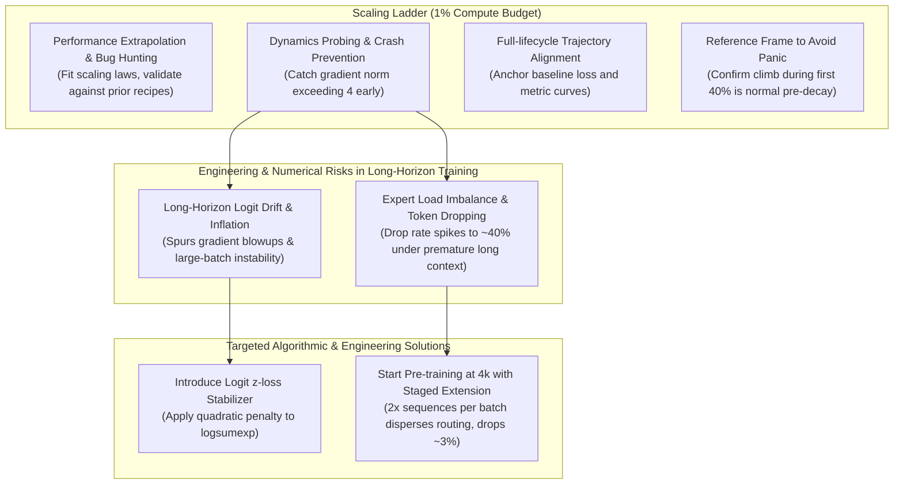
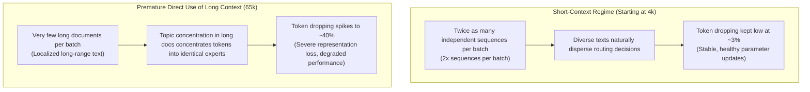

Pre-training a 535B-A23B Mixture-of-Experts (MoE) model across 18T tokens (a ~100-day campaign code-named `[Hero Run] 535B-A23B on 18T tokens`, featuring 535B total parameters and 23B active parameters) requires anticipating four critical failure modes before spending multi-million-dollar compute: scaling law extrapolation, long-horizon logit drift, gradient norm runaway (>4), and token dropping during context expansion.

Based directly on core engineering discussions from this massive pre-training campaign, this article deconstructs the physical mechanisms and operational safeguards behind five foundational concepts: **the Scaling Ladder, Token Horizon vs. Context Length, Gradient Norms, Logit z-loss, and Token Dropping with staged long-context extension**.

---

# 1. Landscape of the Engineering Safeguard System

Confronted with a 100-day training span and massive token throughput, the engineering team exposed latent failure modes early via preliminary ladder runs and established targeted numerical stabilization and scheduling strategies:

---

# 2. Core Concept 1: Scaling Ladder — Full-Lifecycle Insurance for 1% of Compute

Before committing to the full-scale 535B-A23B run across 18T tokens and ~100 days, the team did not blindly launch the job. Instead, they first executed a **Scaling Ladder**.

### What is a Scaling Ladder?
A Scaling Ladder is an **engineering methodology that uses low-cost preliminary runs to surface defects early and build empirical understanding**. Its core principle is straightforward: before kicking off the final ultra-large-scale hero run, maintain the identical model architecture proportions, hyperparameters, and data mixture recipes, but run a series of smaller-scale pre-training experiments across several compact model sizes (e.g., from 61M to 1.2B parameters). This allows the team to map out and observe how key physical quantities and training metrics evolve as scale increases.

Consuming merely **~1% of the total compute budget**, this preparatory phase delivers five pivotal advantages to the remaining 99% compute and 100-day core investment:

### 1. Extrapolating Final Performance and Catching Bugs Early (Recipe Validation)
By collecting loss and benchmark evaluation points across several smaller model scales and fitting them to empirical Scaling Laws, engineers can project the theoretical convergence performance of the mega-scale model after 18T tokens. They can then contrast these projections directly against the scaling curves of the team's prior recipes.
- If the extrapolated performance falls noticeably short of expectations, engineers know immediately that the current architectural tweaks, tokenization, or data cleaning/curation mixture harbor latent deficiencies, signaling that they must "go back to the drawing board."
- This step uncovers subtle bugs early, preventing massive compute waste that would otherwise occur if an underperforming recipe ran to full completion.

### 2. Dynamics Probing and Crash Prevention
In ultra-large-scale distributed training, many fatal anomalies—such as numerical instability, overflow, or sudden loss spikes—are completely invisible over short runs or tiny scales; they only manifest once scale (token volume, batch size, or parameter count) expands past a critical threshold.
- The Scaling Ladder enables the team to observe how training dynamics evolve with scale, especially regarding **gradient norms** and **token dropping**.
- In prior runs, the Scaling Ladder caught a critical failure mode: as training steps and token horizons stretched out, the gradient norm steadily inflated beyond 4. This prompted the team to uncover the root cause and introduce **logit z-loss**. Subsequent ablation experiments verified that without this fix, the model suffered catastrophic gradient explosion and blew up mid-training under specific regimes (such as large batch sizes).

### 3. Trajectory Alignment for Early Warning and Diagnostics
A Scaling Ladder does more than forecast the final convergence endpoint; it traces the expected trajectory of key metrics across the entire training lifecycle (from 0% to 100% completion). If the hero run begins diverging from this reference trajectory at any point, automated monitoring alerts the team immediately, enabling proactive diagnostics before catastrophic divergence occurs.

### 4. Establishing a Baseline Reference to Prevent False Alarms (Confidence & De-noising)
In massive training runs, having an empirical baseline provides engineers with a clear reference frame to distinguish **natural physical phenomena** from **genuine operational faults**.
- For instance, during the Scaling Ladder, the team observed that the gradient norm naturally climbs substantially during the first 40% of the training horizon before gradually retreating as the learning rate decays.
- When the full-scale hero run exhibited a steep rise in gradient norm, having the small-scale baseline allowed the team to verify that this was expected training dynamics. As long as it adhered to the predicted climb during the first 40%, there was no reason to panic, initiate manual pauses, or disrupt the scheduled run.

### 5. Exceptional Compute ROI (1% Compute Buys 100 Days of Certainty)
Investing roughly 1% of total compute buys comprehensive certainty, empirical predictability, and risk mitigation for the remaining 99% compute and the multi-month hero run.

---

# 3. Core Concept 2: Token Horizon vs. Context Length — Disambiguating Two Dimensions of "Length"

In engineering discussions of LLM pre-training, phrases like "longer training horizons" and "long context" frequently appear. While both describe length, they measure entirely different physical dimensions:

| Dimension | Token Horizon (Training Horizon / Step Span) | Context Length / Seqlen (Context Window / Sequence Length) |
| :--- | :--- | :--- |
| **Origin of Term** | Borrowed from operations research and reinforcement learning (*Planning Horizon*) | Originates from the self-attention mechanism (*Attention Window*) |
| **Physical Meaning** | **The aggregate token volume ingested across the entire training lifecycle** | **The maximum input sequence length accepted in a single forward pass** |
| **Primary Focus** | Training duration, optimization steps, cumulative dataset iteration | Single-sample receptive field, long-range semantic dependency modeling |
| **Metric in This Run** | The planned cumulative throughput of **18.0T tokens** (~100 days duration) | **4096 (4k)** tokens during base pre-training, staged up to 262k |
| **Typical Context** | `as we scaled out token horizon` (running more optimization steps over more tokens) | `long context extension` (extending the sequence window from 4k upward) |

> ⚠️ **Critical Clarification**:
> The statement in the discussions, `gradient norm growth to over 4 as we scaled out token horizon`, literally means: **"As we pushed the training duration further and allowed the model to train for longer (ingesting far more cumulative tokens), the gradient norm progressively drifted out of control, exceeding 4."**  
> This pertains strictly to **extending the training duration and total iteration steps**, not expanding the per-sample input context window from 4k to 65k.

---

# 4. Core Concept 3: Gradient Norms and Numerical Health

### 1. Mathematical Definition and Physical Intuition (The Parameter Speedometer)
During backpropagation, the gradients of all trainable parameters are flattened and concatenated into a single global vector $g$. Its magnitude is measured via the Euclidean norm (L2 norm, the square root of the sum of squared gradients):

$$
\|g\|_2 = \sqrt{\sum_i g_i^2}
$$

- **The ELI5 Geometric Intuition**: The gradient norm measures the **aggregate magnitude—the physical length—of the parameter update vector**. Think of it as the speedometer of model parameter motion:
  - In a healthy training regime, updates are gentle, calibrated nudges (the gradient norm hovers stably between 0.5 and 1.5), allowing optimizer momentum and second-moment buffers to track clean descent directions.
  - A gradient norm **steadily climbing beyond 4** signals that parameter updates are turning into **violent, destabilizing jolts**. These oversized steps knock optimizer states off-track, degrade internal representations, and serve as an early harbinger of numerical blowup or catastrophic loss spikes.

### 2. Training Telemetry and Health Indicators
- **Stable Healthy State**: Under normal optimization, the gradient norm remains bounded in a steady corridor (~0.5–1.5), confirming smooth parameter updates.
- **Runaway Warning State**: When telemetry shows the gradient norm escalating past 4 (or spiking into the tens), updates turn chaotic, threatening immediate numerical overflow.
- **Informing Engineering Interventions**: During the Scaling Ladder runs, engineers noticed that as the token horizon accumulated, the gradient norm steadily inflated past 4. This key diagnostic pinpointed output-layer numerical drift, leading directly to the implementation of `logit z-loss`.
- **Natural Optimization Trajectory (Preventing False Alarms)**: In runs governed by learning rate warm-up and cosine decay, the gradient norm naturally climbs across the first 25% to 40% of the training horizon before tapering off smoothly as learning rate annealing takes over. Having this empirical baseline from small-scale ladder runs prevents on-call engineers from misinterpreting a normal early rise as divergence and mistakenly halting the cluster.

---

# 5. Core Concept 4: Logits and the Logit z-loss Stabilization Mechanism

### 1. What is a Logit? (The Microphone Volume Intuition)
In language modeling, a **logit (unnormalized log-odds score)** represents the raw numerical score output by the final projection layer (the LM Head) before Softmax transforms it into a normalized probability distribution:

$$
h \xrightarrow{W_{\text{head}}} z \xrightarrow{\text{Softmax}} p
$$

Assuming a vocabulary size of 128,256, the model outputs a real-valued vector $z \in \mathbb{R}^{128,256}$ for each token position. Each component $z_i$ represents the raw score assigned to token $i$.

- **The ELI5 Microphone Intuition**: Think of logits as the **raw, unnormalized microphone volume levels** output by the model. Softmax acts as a mixing console that converts these volume sliders into percentage probabilities across the entire dictionary, ensuring they strictly sum to 100%. A louder microphone volume (higher logit) means the model is screaming its preference for that token.

### 2. Why Does Long-Horizon Training Cause Logit Drift and Inflation?
Over an extended training horizon (as trillions of tokens are ingested), the cross-entropy optimization objective relentlessly rewards the model for being increasingly confident. Without explicit regularization, the model cranks up its volume sliders indefinitely—logits drift into extreme numerical ranges (e.g., values climbing into the hundreds):
- **Floating-Point Overflow**: While the mathematical Softmax operator is shift-invariant ($\text{Softmax}(z) = \text{Softmax}(z - c)$), finite-precision hardware (FP16/BF16) must exponentiate these numbers during forward and backward passes. Computing $\exp(z_i)$ for excessively large logits quickly overflows FP16/BF16 dynamic ranges (e.g., $\exp(89)$ already overflows FP16 max $\approx 65,504$), generating NaNs and instantly destroying gradients.
- **Gradient Degradation & Norm Runaway**: Bloated logits introduce severe numerical instability into backpropagation gradients, causing the global gradient norm to inflate uncontrollably beyond 4.
- **Catastrophic Blowup under Large Batches**: Ablation experiments confirmed that without an explicit regularizer, models trained under specific regimes—particularly large batch sizes—suffer gradient explosion and blow up mid-flight.

### 3. How Does Logit z-loss Prevent Training Collapses? (The Automatic Acoustic Limiter)
To anchor logits within a numerically safe envelope, the team integrated an auxiliary penalty term directly into the training objective—the **Logit z-loss**:

$$
\mathcal{L}_{\text{total}} = \mathcal{L}_{\text{CE}} + \tau \cdot \left( \log \sum_{i} \exp(z_i) \right)^2
$$

- **The Acoustic Limiter Intuition**: Logit z-loss acts like an **automatic acoustic limiter** on an audio console. It applies a quadratic penalty to $\left(\log \sum \exp(z_i)\right)^2$ (the square of the log-partition function), ensuring the volume never blows out the speaker. If the model attempts to push logits to extreme values, this penalty imposes a steep, proportional restoring force that pulls the logits back into a safe corridor.
- **Mechanistic Breakdown**: Scaled by a hyperparameter $\tau$ (typically $10^{-4}$), this quadratic penalty on the LogSumExp restrains unbounded drift, keeps the global gradient norm bounded below 4, and eradicates mid-training blowups across multi-trillion token marathons.

---

# 6. Core Concept 5: Token Dropping and Staged Long-Context Extension

### 1. MoE Architecture and Token Dropping
The architecture under discussion features a Mixture-of-Experts (MoE) design with **384 total experts**, where each token dynamically routes to and activates **8 experts** during the forward pass.

When deploying **Expert Parallelism (EP)** across a distributed cluster, each hardware accelerator hosting a subset of experts must allocate a **fixed-size token buffer (Capacity)** to ensure synchronous, deterministic tensor operations. This buffer size is determined by a preset Capacity Factor (e.g., 1.15):
- **Definition**: When certain "hot" experts are disproportionately selected by the router and the incoming token volume exceeds the allocated buffer capacity, the overflow tokens are dropped by the hardware. These tokens bypass that expert's forward and backward computation entirely. This mechanism is known as **Token Dropping**.
- **Impact of Dropped Tokens**: Dropped tokens typically pass through the layer via the residual connection alone, missing the non-linear transformations provided by the expert feed-forward network. While minor drop rates (e.g., 1%–3%) have negligible impact on downstream performance, severe drop rates (e.g., reaching 40%) deprive the model of representative capacity, leading to severe degradation in perplexity and generation quality.

### 2. Why Must Initial Pre-training Begin at a 4k Sequence Length?
Why not train at 65k or even longer context lengths from Day 1? The primary operational driver is **suppressing Token Dropping in the MoE layers**:
- **Dispersing Routing via More Sequences per Batch**: Under a fixed batch memory budget, a 4k sequence length accommodates twice as many distinct, independent sequences as an 8k sequence length (`twice as many sequences per batch`).
- **Sample Diversity Balances Expert Load**: With greater sample diversity across documents and domains, routing decisions distribute evenly across the 384 experts, preventing hotspots. Under 4k sequences, the token drop rate remains well-controlled at approximately **3%**.
- **Avoiding Localized Clumping**: If pre-training commenced immediately with 65k sequences, each batch would contain only a handful of long documents. The strong semantic and lexical cohesion within each individual document causes tokens to concentrate overwhelmingly on the same small subset of experts, causing the drop rate to spike catastrophically to **~40%**.

### 3. Staged Long-Context Extension Plan
To reconcile expert load balancing with extended context modeling capabilities, the team formulated a disciplined staged extension schedule:
1. **0% to 50% Progress (Base Foundation Stage)**: Train at **4k (4096)** sequence length, leveraging high sequence diversity to keep token dropping at ~3% while consolidating core representations;
2. **At 50% Progress**: Extend from 4k to **8k (8192)**;
3. **At 95% Progress**: Extend from 8k to **65k (65536)**;
4. **Near End Stage**: Sprint extension to the ultimate **262k (262144)** ultra-long context window.

When expanding sequence lengths, RoPE attention scaling is adjusted synchronously to update `qk_mult`:

$$
m_{\text{scale}} = X \cdot \ln\left(\frac{\text{new\_seqlen}}{\text{old\_seqlen}}\right) + 1
$$

This ensures positional encodings and attention logits maintain numerical stability throughout context window expansions.

---

# 7. Self-Check and Review (Interactive Quiz)

Verify your operational understanding of Scaling Ladders, token horizon vs. context length, gradient norms, logit z-loss, and MoE routing dynamics. Select your answers below and click **Submit Answers** for instant feedback and detailed post-mortems.

<link rel="stylesheet" href="{{ base_path }}/assets/css/interactive-quiz.css">

  
⚡ Pre-training Dynamics & Architecture Self-Assessment

  
Verify your operational understanding of Scaling Ladders, token horizon vs. context length, gradient norms, logit z-loss, and MoE routing dynamics.

  <form id="pretraining-hero-run-quiz" class="interactive-quiz-form" data-answer-key='{"q1":"C","q2":"B","q3":"A","q4":"D"}' data-msg-perfect="🎯 &lt;strong&gt;Score: 4/4 (100%):&lt;/strong&gt; Flawless. You have complete mastery over scaling ladders, logit z-loss acoustic limiting, and staged MoE context extension." onsubmit="return false;">
    
    <!-- Question 1 -->
    

      
Q1. (Conceptual Clarification & Terminology) 
      Which of the following statements regarding LLM pre-training terminology is correct?

      
      

        <label class="quiz-option" id="label-q1-A" data-option="A">
          <input type="radio" name="q1" value="A">
          <strong>A.</strong> Token Horizon refers to the maximum sequence length accepted by the model in a single forward pass (e.g., 4k or 65k).
        </label>
        <label class="quiz-option" id="label-q1-B" data-option="B">
          <input type="radio" name="q1" value="B">
          <strong>B.</strong> A logit is the normalized probability value (between 0 and 1) obtained after passing output scores through Softmax.
        </label>
        <label class="quiz-option" id="label-q1-C" data-option="C">
          <input type="radio" name="q1" value="C">
          <strong>C.</strong> Token Dropping refers to the phenomenon in MoE architectures where tokens exceeding an expert's pre-allocated capacity buffer are discarded.
        </label>
        <label class="quiz-option" id="label-q1-D" data-option="D">
          <input type="radio" name="q1" value="D">
          <strong>D.</strong> A continuously climbing Gradient Norm is normal training dynamics that never leads to numerical overflow or model collapse.
        </label>
      

      

        <strong>Detailed Breakdown:</strong> Under MoE Expert Parallelism, when tokens dispatched to an expert exceed its pre-allocated capacity buffer (defined by the Capacity Factor), excess tokens bypass the expert's computation—a mechanism termed Token Dropping. Option A confuses Context Length (Seqlen) with Token Horizon (cumulative training throughput); Option B confuses unnormalized raw logits with Softmax probabilities; Option D ignores that sustained gradient norm inflation past 4 is a leading indicator of gradient explosion.
      

    

    <!-- Question 2 -->
    

      
Q2. (Engineering Decision-Making & Telemetry Diagnostics) 
      During the hero run at 25% progress, telemetry shows that the gradient norm has steadily risen from 1.0 to 3.2. Based on the team's methodology in the discussion, what is the most appropriate engineering response?

      
      

        <label class="quiz-option" id="label-q2-A" data-option="A">
          <input type="radio" name="q2" value="A">
          <strong>A.</strong> Halt the run immediately, as a steadily climbing gradient norm signifies optimizer divergence requiring an emergency learning rate cut.
        </label>
        <label class="quiz-option" id="label-q2-B" data-option="B">
          <input type="radio" name="q2" value="B">
          <strong>B.</strong> Continue observing without halting, provided the trajectory matches the empirical progression seen in prior small-scale ladder runs, since gradient norms naturally climb during the first 25%–40% before tapering off as learning rate decays.
        </label>
        <label class="quiz-option" id="label-q2-C" data-option="C">
          <input type="radio" name="q2" value="C">
          <strong>C.</strong> Immediately jump the context length from 4k directly to 65k to suppress the gradient norm.
        </label>
        <label class="quiz-option" id="label-q2-D" data-option="D">
          <input type="radio" name="q2" value="D">
          <strong>D.</strong> Conclude that silent data corruption (SDC) has occurred on the GPUs and isolate affected nodes.
        </label>
      

      

        <strong>Detailed Breakdown:</strong> A primary dividend of the Scaling Ladder is establishing an empirical reference trajectory. Under standard learning rate schedules, the gradient norm naturally rises across the initial 25%–40% warm-up and early exploration phase before retreating as annealing takes effect. Matching this baseline reassures engineers to maintain execution without panicking or triggering unwarranted manual pauses.
      

    

    <!-- Question 3 -->
    

      
Q3. (Mechanistic Analysis & MoE Routing Economics) 
      Why did the team choose a 4k sequence length in early pre-training instead of initiating the run directly at 65k?

      
      

        <label class="quiz-option" id="label-q3-A" data-option="A">
          <input type="radio" name="q3" value="A">
          <strong>A.</strong> At 4k sequence length, each batch contains twice as many independent sequences (2x sequences per batch), which balances expert loads across the MoE router and substantially reduces token dropping.
        </label>
        <label class="quiz-option" id="label-q3-B" data-option="B">
          <input type="radio" name="q3" value="B">
          <strong>B.</strong> Models cannot acquire valid world knowledge when trained directly on 65k sequence lengths.
        </label>
        <label class="quiz-option" id="label-q3-C" data-option="C">
          <input type="radio" name="q3" value="C">
          <strong>C.</strong> Computational complexity is strictly linear at 4k, whereas FlashAttention cannot be deployed at 65k.
        </label>
        <label class="quiz-option" id="label-q3-D" data-option="D">
          <input type="radio" name="q3" value="D">
          <strong>D.</strong> The available GPU VRAM was completely insufficient to fit 65k input tokens.
        </label>
      

      

        <strong>Detailed Breakdown:</strong> Under a fixed batch memory budget, a 4k sequence length accommodates twice as many independent sequences as an 8k length (and far more than 65k). High document diversity disperses router queries across all 384 experts, keeping the token drop rate at ~3%. Starting directly at 65k severely restricts sequence count per batch, causing intra-document lexical clumping to overload identical experts and spike token dropping to ~40%.
      

    

    <!-- Question 4 -->
    

      
Q4. (Algorithmic Provenance & Stabilization Mechanism) 
      What primary problem was <code>logit z-loss</code> introduced to resolve, and how was it identified?

      
      

        <label class="quiz-option" id="label-q4-A" data-option="A">
          <input type="radio" name="q4" value="A">
          <strong>A.</strong> It resolves attention weight underflow, and was discovered only after the full-scale 535B model blew up at 50% completion.
        </label>
        <label class="quiz-option" id="label-q4-B" data-option="B">
          <input type="radio" name="q4" value="B">
          <strong>B.</strong> It resolves backpropagation communication bottlenecks, and was suggested automatically by the compiler during custom kernel optimization.
        </label>
        <label class="quiz-option" id="label-q4-C" data-option="C">
          <input type="radio" name="q4" value="C">
          <strong>C.</strong> It resolves MoE router load imbalance, and was uncovered while comparing perplexities between 8k and 65k contexts.
        </label>
        <label class="quiz-option" id="label-q4-D" data-option="D">
          <input type="radio" name="q4" value="D">
          <strong>D.</strong> It resolves logit drift and uncontrolled gradient norm inflation (>4) during long-horizon training (extended token horizons), and was identified and validated early during small-scale Scaling Ladder runs.
        </label>
      

      

        <strong>Detailed Breakdown:</strong> Stretching the training horizon during small-scale Scaling Ladder runs revealed that unconstrained logits drift upward over time, pushing the global gradient norm beyond 4 and triggering divergence under large batches. Introducing logit z-loss (penalizing \(\log^2 \sum \exp(z_i)\)) acts as an acoustic limiter, anchoring logits in a safe numerical envelope and ensuring robust convergence.
      

    

    <!-- Action Buttons and Result Summary -->
    

      <button type="button" class="quiz-btn quiz-btn-primary" id="btn-submit-quiz">Submit Answers</button>
      <button type="button" class="quiz-btn quiz-btn-secondary" id="btn-reset-quiz">Reset Quiz</button>
    

    

  </form>

---

# 8. Summary and Engineering Takeaways

From this technical exploration into the 535B-A23B pre-training campaign, three foundational systems engineering principles emerge:

1. **Trade 1% Compute at Small Scale for 100 Days of Certainty (The Scaling Ladder Philosophy)**:
   Pre-training ultra-large models must never rely on "launching blindly and praying for stability." Running small-scale ladder runs to fit scaling laws, hunt bugs, expose dynamic failure modes early, and construct baseline trajectories provides the ultimate hedge against catastrophe.
2. **Deconstruct Conceptual Dimensions and Guard Against Long-Horizon Drift (Token Horizon vs. Logit z-loss)**:
   Token Horizon governs the temporal depth of optimization steps and aggregate throughput, whereas Context Length defines the spatial span of single-sample receptive fields. As training horizons stretch, unconstrained output logits quietly inflate and destabilize gradient norms (>4). Incorporating a logit z-loss regularizer is essential to ensure stable convergence under large-batch regimes.
3. **Harmonize Routing Balance and Long-Range Context Modeling (Token Dropping Governance)**:
   In MoE architectures, shorter initial sequences (4k) provide a higher density of independent sequences per batch, dispersing routing queries and keeping token dropping within a healthy 3% ceiling. Adopting a staged expansion schedule—establishing solid foundations at 4k before systematically transitioning to 8k, 65k, and 262k—represents an established paradigm for balancing expert utilization with long-range modeling capabilities.
