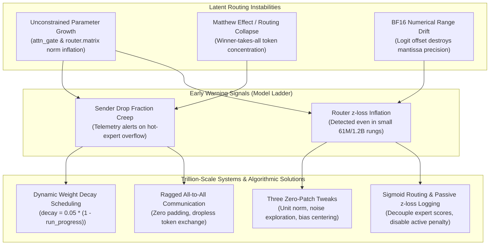
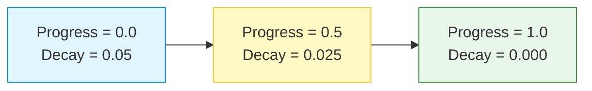
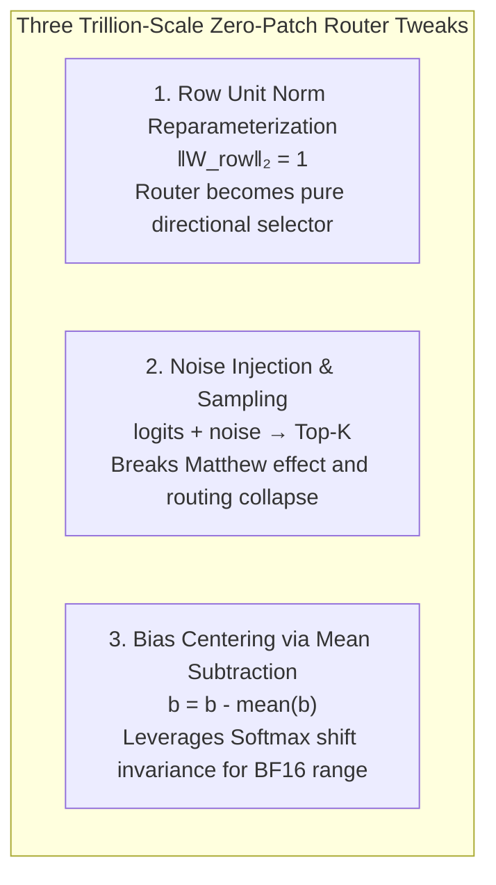
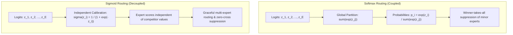
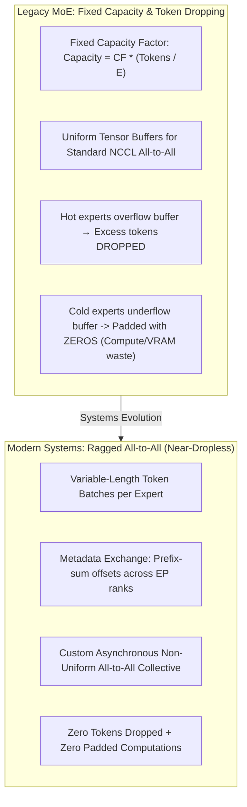

In [Part 1 of this series](), we analyzed macro-level training dynamics, Scaling Ladder forecasting, and output logit z-loss regularizers at the final model head. However, stabilizing the final projection layer only addresses macro output boundaries; the internal sparse routing mechanics and attention gating layers introduce micro-level numerical volatility. Over millions of distributed optimizer steps, subtle mathematical imbalances inside the router compound into gate weight norm explosion, noisy exploration gradient variance, and BF16 mantissa underflow during softmax.

This article—**Part 2**—drills directly into the interior routing physics of ultra-large Mixture-of-Experts architectures. We deconstruct the mechanisms driving unconstrained gate norm inflation, why dynamic weight decay scheduling ($\lambda_{\text{decay}} = 0.05 \cdot (1 - \text{run\_progress})$) acts as a stabilizing clamp, and how **three zero-patch architectural tweaks**—row unit norm reparameterization, noise injection decoupling, and bias centering—eliminate router collapse from scratch without modifying parameter shapes or breaking checkpoint compatibility. Finally, we deconstruct the architectural shift from Softmax to decoupled Sigmoid routing and the distributed systems transition to dropless ragged all-to-all communication.

---

# 1. Landscape of MoE Internal Instabilities

In standard dense Transformers, representations pass through identical feed-forward blocks across all sequence positions. In sparse Mixture-of-Experts architectures, by contrast, each token is dynamically assigned to a subset of experts (e.g., top-8 out of 384 experts) via a parameter-matrix projection:

$$
z = x W_{\text{gate}}^T + b
$$

Because these routing projections operate without residual anchors, layer normalizations, or bounded activations, they represent the most unconstrained parameter group in the entire network:



---

# 2. The Mechanics of Gate Norm Inflation and Early Warning Signals

### 1. Unchecked Norm Growth in `attn_gate` and `router.matrix`
During deep pre-training of the **535B-A23B model** across multi-trillion token horizons (18T tokens), core pre-training engineers observed a pervasive phenomenon: the parameter norms ($\|W\|_2$) of both **attention gate projections** (`attn_gate`) and **expert routing matrices** (`router.matrix`) steadily inflate over time.

Why do these specific layers act as amplifiers?
- **Absence of Direct Normalization**: Unlike standard attention projections ($W_q, W_k, W_v$) and MLP projections ($W_{\text{gate}}, W_{\text{up}}, W_{\text{down}}$), which are bounded by preceding LayerNorm or RMSNorm layers and anchored by residual additions, routing matrices project normalized states into unnormalized logit spaces.
- **Positive Feedback Loops in Routing**: When a router matrix develops even a slight initial preference for an expert, that expert receives more tokens, accumulates more gradient updates, and refines its representations faster than inactive experts. The router, in turn, receives larger backpropagated gradients reinforcing that preference. Over millions of optimizer steps, the weight vectors corresponding to favored experts stretch outwards, driving up the matrix norm.
- **Logit Inflation and Distribution Sharpening**: As $\|W_{\text{gate}}\|_2$ grows, the unnormalized routing logits $z_i$ scale proportionally. In a Softmax router, scaling logits by a factor $\alpha > 1$ sharpens the resulting probability distribution $p_i = \frac{e^{\alpha z_i}}{\sum_j e^{\alpha z_j}}$, pushing the router toward deterministic one-hot assignments and collapsing the gradient flow to alternative experts.

### 2. Early Warning Signals in the Scaling Ladder
Crucially, these failure modes do not emerge out of nowhere on Day 60 of the 535B-A23B 100-day hero run. When telemetry is properly instrumented across the preliminary rungs of the **Scaling Ladder** (e.g., 61M, 350M, and 1.2B parameter models), two primary metrics surface as sensitive canary indicators:

1. **Sender Drop Fraction Creeping Up (`sender drop fraction increase`)**:
   Under fixed-capacity Expert Parallelism in the 535B run, when routing begins collapsing into a subset of experts, the accelerator ranks hosting those experts rapidly exceed their assigned token buffer. The sender ranks are forced to drop tokens before dispatch. Even a minor upward drift in sender drop fractions (e.g., from 1% to 4%) during the initial 10% of training flags an impending routing collapse.
2. **Router z-loss Creeping Up (`z-loss creeping up`)**:
   Tracking the auxiliary router z-loss:
   
   $$
   \mathcal{L}_z = \tau \cdot \left( \log \sum_{i=1}^{E} \exp(z_i) \right)^2
   $$
   
   reveals whether the routing partition function is inflating. When the log-partition function creeps up persistently across lower rungs of the model ladder, it indicates that the routing weights are escaping numerical equilibrium.

---

# 3. The First Line of Defense: Dynamic Weight Decay Scheduling

To suppress norm growth in gating and routing layers during the frontline 535B-A23B pre-training run without impairing the model's capacity to form sharp routing decisions toward the end of training, pre-training teams introduced a **dynamic weight decay schedule** tailored specifically to `attn_gate` and `router.matrix`.

### 1. The Scheduling Formulation
Rather than applying a static weight decay coefficient throughout the run, the decay applied to the gating parameter group is coupled directly to the training progress:

$$
\lambda_{\text{decay}}(t) = 0.05 \cdot (1 - \text{run\_progress})
$$

where $\text{run\_progress} = \frac{t}{T_{\text{total}}} \in [0, 1]$, representing the ratio of the current optimization step $t$ to the total planned training horizon $T_{\text{total}}$.



### 2. Physical and Optimization Rationale
- **Phase 1: High Early Regularization ($\text{run\_progress} \in [0, 0.3]$)**:
  During early pre-training, parameter updates are chaotic, gradient variance is high, and representations are unformed. A robust weight decay of up to $0.05$ exerts an active restoring force ($-\lambda w$), continuously penalizing norm growth. This prevents the router weights from shooting out to large magnitudes before the experts have learned basic syntactic and semantic features.
- **Phase 2: Linear Relaxation ($\text{run\_progress} \in [0.3, 0.8]$)**:
  As experts begin specializing (e.g., handling specific languages, code structures, or reasoning primitives), the router must be granted sufficient flexibility to express confident selections without being over-penalized. The decay strength steadily anneals downward.
- **Phase 3: Zero-Decay Convergence ($\text{run\_progress} \in [0.8, 1.0]$)**:
  In the final 20% of the training horizon (coinciding with learning rate annealing and final performance consolidation), the weight decay approaches zero. This permits the router to lock in fine-grained expert dispatch boundaries without artificial parameter shrinkage degrading final evaluation perplexity.

### 3. Implementation in PyTorch Optimizer Groups
In distributed training frameworks (such as Megatron-LM or custom PyTorch training engines), gating parameters are isolated into a dedicated optimizer parameter group whose weight decay is dynamically updated per iteration:

```python
import torch
from torch.optim import AdamW

def build_moe_optimizer(model, base_lr=1e-4, base_weight_decay=0.1):
    gate_params = []
    standard_params = []

    for name, param in model.named_parameters():
        if not param.requires_grad:
            continue
        # Isolate attention gates and MoE router matrices
        if "attn_gate" in name or "router.matrix" in name:
            gate_params.append(param)
        else:
            standard_params.append(param)

    param_groups = [
        {"params": standard_params, "weight_decay": base_weight_decay, "lr": base_lr},
        {"params": gate_params, "weight_decay": 0.05, "lr": base_lr, "is_gate": True}
    ]
    
    return AdamW(param_groups, betas=(0.9, 0.95), eps=1e-8)

def update_gate_weight_decay(optimizer, current_step: int, total_steps: int):
    """
    Applies: decay = 0.05 * (1 - run_progress) to the gating parameter group.
    """
    run_progress = min(max(current_step / total_steps, 0.0), 1.0)
    scheduled_decay = 0.05 * (1.0 - run_progress)
    
    for group in optimizer.param_groups:
        if group.get("is_gate", False):
            group["weight_decay"] = scheduled_decay
```

---

# 4. The Three Trillion-Scale Zero-Patch Router Tweaks

While dynamic weight decay significantly mitigates norm inflation during flight, safeguarding the 535B-A23B run—and charting the engineering path toward future multi-trillion-parameter architectures—demands structural architectural guarantees. To permanently neutralize routing degeneration, pre-training architects turned to **three "zero-patch" router tweaks**.

Crucially, these three modifications are not ad-hoc emergency patches invented mid-flight. They are robust engineering principles **previously validated at the trillion-parameter scale from scratch without mid-flight patching**, which are now applied to safeguard this 535B-A23B pre-training run and establish the architectural baseline for future trillion-scale frontiers.

> **Why "Zero-Patch"?**  
> In production deep learning, modifying model definitions mid-project often breaks checkpoint backward compatibility, requires re-allocating optimizer states, or incurs non-negligible computational overhead. A **zero-patch tweak** is a drop-in mathematical modification that requires **zero extra parameters**, introduces **zero tensor-shape changes**, maintains **100% checkpoint compatibility**, and mathematically eliminates underlying numerical degeneration.



---

### Tweak 1: Row Unit Norm Reparameterization ($\|W_{\text{row}}\|_2 = 1$)

#### 1. Mathematical Formulation
In a standard router with $E$ experts and hidden dimension $D$, the weight matrix is $W \in \mathbb{R}^{E \times D}$. Each row $W_{i, :}$ corresponds to the routing centroid of expert $i$. 

Under row unit norm reparameterization, each row is normalized by its Euclidean L2 norm during the forward pass:

$$
\widetilde{W}_{i, :} = \frac{W_{i, :}}{\|W_{i, :}\|_2} = \frac{W_{i, :}}{\sqrt{\sum_{j=1}^D W_{i, j}^2 + \epsilon}}
$$

The unnormalized logit for token $x \in \mathbb{R}^D$ and expert $i$ becomes:

$$
z_i = x \cdot \widetilde{W}_{i, :}^T + b_i = \|x\|_2 \cos(\theta_{x, W_i}) + b_i
$$

#### 2. Physical and Systems Impact (ELI5: The Compass Needle)
> **ELI5 Intuition**: Picture each expert's routing vector as a needle on a compass. In unconstrained routing, a router can artificially inflate its preference for an expert simply by stretching that needle to 100× its original length, drowning out competitor signals and triggering runaway logit growth. Row-normalizing the weights ($\|W_{\text{row}}\|_2 = 1$) strips away that arbitrary scale and locks every needle to a length of exactly 1. The router is stripped of magnitude degrees of freedom and forced to act as a **pure compass needle**—selecting experts based strictly on pointing direction (the cosine angle $\theta$ between the token vector and the expert centroid) rather than parameter magnitude.

- **Eliminating the Uncontrolled Amplifier**: By stripping the router of its magnitude degree of freedom, the router is mathematically barred from increasing logits simply by stretching its parameter vectors. The router transforms from an uncontrolled magnitude amplifier into a **pure cosine-similarity directional selector**.
- **Bounded Logit Envelope**: The dynamic range of the logits is strictly bounded by the norm of the input token representation: $|z_i - b_i| \le \|x\|_2$. Because token embeddings and hidden states are governed by RMSNorm, the inputs to the router have a fixed, well-behaved norm ($\|x\|_2 \approx \sqrt{D}$), guaranteeing that router logits cannot drift to infinity.
- **Zero-Patch Compatibility**: The parameter tensor $W$ stored on disk remains identical in shape ($E \times D$). The normalization is performed on the fly in the forward pass.

---

### Tweak 2: Noise Injection & Exploration Sampling over Hard Top-K

#### 1. The Failure Mode: The Matthew Effect ("Winner-Takes-All")
In standard Top-K routing:

$$
\text{indices} = \text{TopK}(z, K)
$$

If expert $e_1$ receives a slightly higher initialization score or early data alignment, it consistently wins the argmax/top-k competition. In hard top-k selection, non-selected experts receive **zero gradient** for that token:

$$
\frac{\partial \mathcal{L}}{\partial W_{e_{\text{unselected}}}} = 0
$$

This creates a vicious cycle: favored experts continuously update and improve their specialized representations, widening the performance gap against unselected experts. Unselected experts become completely starved of tokens, permanently idling accelerator VRAM and compute capacity.

#### 2. Injecting Noise for Continuous Exploration
To shatter this positive feedback loop without changing the deterministic inference topology, controlled exploration noise is injected into the unnormalized logits prior to Top-K selection during training:

$$
\widetilde{z}_i = z_i + \epsilon_i \cdot \sigma_{\text{noise}}
$$

where $\epsilon_i \sim \mathcal{N}(0, 1)$ (or standard Gumbel noise $\epsilon_i \sim \text{Gumbel}(0, 1)$), and $\sigma_{\text{noise}}$ is an exploration scale factor.

- **Breaking Early Lock-in**: Even if an expert lags slightly behind in initial logit value, the additive perturbation grants it a finite probability of being selected.
- **Guaranteed Exploration Budget**: Early in the training lifecycle, all 384 experts receive a healthy quota of tokens across diverse semantic domains, allowing their feed-forward weights to stabilize before routing decisions crystalize.
- **Decoupling Exploration from Blending Weights (ELI5: The Random Food Recommendation)**:
  > **ELI5 Intuition**: Imagine deciding which restaurant to try based on a roll of dice to force yourself to explore new places. But once you sit down to eat, you rate the meal strictly on its actual taste—not on the random number you rolled! Adding random noise to logits forces the router to explore new paths and prevents cold experts from starving. However, if you also used those noisy scores to compute gradients and blend token representations, you would inject pure random jitter directly into the backward pass, corrupting the model's hidden representations. By **decoupling** selection from blending—using noisy scores solely to pick the discrete Top-K expert paths, but gathering clean, uncorrupted logits (`torch.gather(logits, ...)`) to compute the actual Softmax blending weights—the router explores new paths freely while backpropagation remains clean and unpoisoned by random jitter.
  In industrial pre-training frameworks, noisy logits are used exclusively to determine discrete top-k routing indices (`topk_indices`), while clean gathered logits determine the normalized dispatch weights.
- **Annealing for Deterministic Inference**: During validation and final pre-training stages, $\sigma_{\text{noise}} \to 0$, ensuring inference executes deterministic top-k dispatch.

---

### Tweak 3: Bias Centering via Mean Subtraction ($b \leftarrow b - \text{mean}(b)$)

#### 1. Mathematical Formulation
For any bias vector $b \in \mathbb{R}^E$, mean subtraction re-centers the coordinates around zero:

$$
\widetilde{b} = b - \frac{1}{E} \sum_{j=1}^E b_j
$$

#### 2. Softmax Shift Invariance
The Softmax function possesses exact shift invariance: for any arbitrary real scalar constant $c \in \mathbb{R}$:

$$
\text{Softmax}(z)_i = \frac{e^{z_i - c}}{\sum_{j=1}^E e^{z_j - c}} = \frac{e^{-c} e^{z_i}}{e^{-c} \sum_{j=1}^E e^{z_j}} = \frac{e^{z_i}}{\sum_{j=1}^E e^{z_j}} = \text{Softmax}(z)_i
$$

Setting $c = \text{mean}(b)$ preserves the exact mathematical probability distribution.

#### 3. Why is Bias Centering Critical for Trillion-Scale BF16 Training? (ELI5: The Stretched Ruler)
> **ELI5 Intuition**: Think of floating-point precision like marks on an elastic ruler where the tick marks stretch farther apart as numbers grow. In 16-bit brain float (BF16), only 7 bits are reserved for mantissa precision. Near zero, the tick marks are microscopic (fractions of a thousandth apart), easily capturing subtle differences between expert scores. But when numbers get large (like a router bias drifting up to $+64.0$), the gap between consecutive representable numbers—the ULP (Unit in the Last Place)—stretches out to $0.5$. If Expert 1 scores $64.25$ and Expert 2 scores $64.05$, the subtle $0.20$ difference is narrower than the ruler's coarse spacing! Both round to the exact same float, and the router effectively goes blind. Because Softmax is strictly shift-invariant ($\text{Softmax}(z) = \text{Softmax}(z - c)$), subtracting the mean ($b \leftarrow b - \text{mean}(b)$) slides all numbers straight back to the precision sweet spot near zero without altering softmax outputs in the slightest.

While Softmax is analytically shift-invariant on infinite-precision real numbers ($\mathbb{R}$), modern distributed hardware accelerates computation using **Bfloat16 (BF16)**. 

BF16 allocates **8 bits for the exponent** and only **7 bits for the mantissa** (fractional precision). This configuration yields an effective precision of approximately 2 to 3 decimal digits:

| Floating-Point Format | Sign Bits | Exponent Bits | Mantissa (Fraction) Bits | Dynamic Range | Relative Precision ($\epsilon_{\text{mach}}$) |
| :--- | :--- | :--- | :--- | :--- | :--- |
| **IEEE FP32** | 1 | 8 | 23 | $\approx 10^{\pm 38}$ | $\approx 1.19 \times 10^{-7}$ |
| **IEEE FP16** | 1 | 5 | 10 | $\approx 10^{\pm 4.8}$ | $\approx 9.77 \times 10^{-4}$ |
| **Bfloat16 (BF16)** | 1 | 8 | 7 | $\approx 10^{\pm 38}$ | $\approx 7.81 \times 10^{-3}$ |

Over billions of steps, if the router bias vector $b$ undergoes unconstrained DC drift—for example, drifting to a mean value of $+64.0$—the relative logit differences between experts (typically spanning ranges of $0.01$ to $0.5$) must be represented alongside the large baseline offset:

$$
z_1 = 64.25, \quad z_2 = 64.05 \implies \Delta z = 0.20
$$

In BF16, the gap between consecutive representable numbers (ULP, Unit in the Last Place) at a magnitude of $64.0$ is:

$$
\text{ULP}(64.0) = 2^{6 - 7} = 2^{-1} = 0.5
$$

Because the ULP ($0.5$) is larger than the semantic routing difference ($\Delta z = 0.20$), **catastrophic cancellation occurs: $64.25$ and $64.05$ round to the exact same representable float!** The router loses all discrimination capacity, and routing updates stall due to numerical quantization noise.

By subtracting $\text{mean}(b)$, the bias vector is centered around $0.0$, where the ULP in BF16 is:

$$
\text{ULP}(0.5) = 2^{-1 - 7} = 2^{-8} \approx 0.0039
$$

This restores high-resolution differentiation among experts without altering the mathematical routing function.

---

### 4. Complete PyTorch Implementation of the Zero-Patch Router

The following production-grade PyTorch module combines row unit norm reparameterization, bias centering, and noise injection into a single drop-in replacement:

```python
import torch
import torch.nn as nn
import torch.nn.functional as F

class ZeroPatchMoERouter(nn.Module):
    """
    Zero-Patch Stable MoE Router implementing:
    1. Row Unit Norm Reparameterization (‖W_row‖₂ = 1)
    2. Bias Centering via Mean Subtraction (b <- b - mean(b))
    3. Noise Injection & Discrete Selection Decoupling:
       Noisy logits drive top-k exploration, while clean logits
       gathered via torch.gather determine the final blend weights.
    """
    def __init__(
        self,
        d_model: int,
        num_experts: int,
        top_k: int = 8,
        noise_scale: float = 1.0,
        decouple_noise: bool = True,
        eps: float = 1e-6
    ):
        super().__init__()
        self.d_model = d_model
        self.num_experts = num_experts
        self.top_k = top_k
        self.noise_scale = noise_scale
        self.decouple_noise = decouple_noise
        self.eps = eps

        # Weight: [num_experts, d_model]
        self.weight = nn.Parameter(torch.empty(num_experts, d_model))
        self.bias = nn.Parameter(torch.zeros(num_experts))
        
        nn.init.normal_(self.weight, mean=0.0, std=0.02)

    def forward(self, x: torch.Tensor):
        """
        Args:
            x: Input tensor of shape [batch_size * seq_len, d_model]
        Returns:
            topk_weights: Normalized routing weights [num_tokens, top_k]
            topk_indices: Selected expert indices [num_tokens, top_k]
            raw_logits: Pre-noise centered logits [num_tokens, num_experts]
        """
        # Tweak 1: Row Unit Norm Reparameterization
        # Normalize each expert's routing vector along the feature dimension
        norm_weight = F.normalize(self.weight, p=2, dim=-1, eps=self.eps)

        # Tweak 3: Bias Centering via Mean Subtraction
        # Softmax shift invariance guarantees identical probabilities while preserving BF16 precision
        centered_bias = self.bias - self.bias.mean()

        # Compute stable logits: [num_tokens, num_experts]
        logits = F.linear(x, norm_weight, centered_bias)

        # Tweak 2: Noise Injection during Training for Exploration
        if self.training and self.noise_scale > 0.0:
            noise = torch.randn_like(logits) * self.noise_scale
            routing_scores = logits + noise
        else:
            routing_scores = logits

        # Dispatch top-k selection (driven by exploration scores)
        _, topk_indices = torch.topk(routing_scores, k=self.top_k, dim=-1)
        
        # Industrial Best Practice: Decouple exploration from blend weights
        # Gather clean, uncorrupted logits to avoid injecting gradient noise into representations
        if self.decouple_noise:
            clean_topk_logits = torch.gather(logits, dim=-1, index=topk_indices)
            topk_weights = F.softmax(clean_topk_logits, dim=-1)
        else:
            topk_scores = torch.gather(routing_scores, dim=-1, index=topk_indices)
            topk_weights = F.softmax(topk_scores, dim=-1)

        return topk_weights, topk_indices, logits
```

---

# 5. Sigmoid vs. Softmax Routing & The Role of Router z-loss

As sparse architectures progressed from early top-2 MoE implementations toward trillion-token configurations with 256 to 384 experts, pre-training teams re-examined the fundamental scoring mechanism: **Softmax versus Sigmoid routing**.

### 1. Comparative Analysis



| Dimension | Softmax Routing | Sigmoid Routing |
| :--- | :--- | :--- |
| **Mathematical Formulation** | $p_i = \frac{\exp(z_i)}{\sum_{j=1}^E \exp(z_j)}$ | $s_i = \sigma(z_i) = \frac{1}{1 + \exp(-z_i)}$ |
| **Expert Probability Coupling** | **Globally Coupled**: $\sum_{i=1}^E p_i = 1$. An increase in expert $A$'s logit forces expert $B$'s probability down. | **Decoupled**: Each expert's score is computed independently in $[0, 1]$. |
| **Outlier Logit Impact** | Extreme logit in one expert drives all other expert probabilities to zero (catastrophic starvation). | Extreme logit saturates only that single expert; other experts retain unperturbed scores. |
| **Gradient Dynamics** | $\frac{\partial p_i}{\partial z_j} = p_i(\delta_{ij} - p_j)$ (cross-coupled gradients across all experts). | $\frac{\partial s_i}{\partial z_i} = s_i(1 - s_i)$ (isolated, localized gradient propagation). |
| **Top-K Normalization** | Naturally normalized across top-k or re-normalized post-selection. | Scores for the top-k selected experts are normalized: $w_k = \frac{s_k}{\sum_{m \in \text{TopK}} s_m}$. |

### 2. The Fate of Router z-loss under Sigmoid Routing
In Softmax-based routers, **Router z-loss** is actively included in the backpropagation objective to constrain the denominator of the Softmax function:

$$
\mathcal{L}_z = \tau \cdot \left( \log \sum_{i=1}^E \exp(z_i) \right)^2, \quad \mathcal{L}_{\text{total}} = \mathcal{L}_{\text{task}} + \mathcal{L}_{\text{aux}} + \mathcal{L}_z
$$

When the architecture transitions to **Sigmoid routing**, what happens to Router z-loss?

1. **Mathematical Incompatibility as an Active Loss**:
   Sigmoid routing does not compute a shared partition function $\sum_{i=1}^E \exp(z_i)$. Applying the Softmax z-loss penalty to Sigmoid logits exerts an artificial, distorted shrinkage on independent expert affinities, pulling valid positive selections back toward zero.
2. **Disabling Active z-loss**:
   In Sigmoid-routed systems, **active Router z-loss is disabled from the loss function** ($\tau \leftarrow 0$ during backpropagation).
3. **Preserving z-loss as a Passive Logging Canary**:
   Although eliminated from the backward pass, the quantity $\left(\log \sum \exp(z_i)\right)^2$ or $\frac{1}{E} \sum z_i^2$ is **retained in telemetry logs as a passive monitoring metric**. If this value creeps upward during training, it signals that router logits are drifting into saturation regimes ($\sigma(z_i) \to 1.0$), providing an early alert before gradients vanish due to Sigmoid derivative saturation ($s_i(1 - s_i) \to 0$).

---

# 6. The Systems Leap: From Capacity Token Dropping to Ragged All-to-All

In Part 1, we analyzed how teams mitigate token dropping under Expert Parallelism by maintaining short 4k sequences during early pre-training. However, at a foundational systems level, why does token dropping exist in the first place, and how do modern pre-training engines eradicate it entirely?



### 1. The Legacy Paradigm: Fixed Expert Capacity
Distributed Expert Parallelism shards $E$ experts across $P$ processing ranks. Tokens located on GPU $A$ destined for an expert hosted on GPU $B$ must be routed across the network fabric via distributed collectives (`All-to-All`).

Standard collective communication libraries (e.g., standard NCCL `all_to_all`) require uniformly shaped, rectangular tensors across all participating ranks. To satisfy this constraint, legacy systems assigned a **fixed capacity buffer** to every expert:

$$
\text{Capacity} = \text{Capacity Factor (CF)} \times \left( \frac{N \times K}{E} \right)
$$

This introduced a punishing engineering dilemma:
- **Low Capacity Factor (CF = 1.0 - 1.15)**: Minimal memory overhead, but any topic concentration or routing imbalance causes hot experts to exceed capacity, triggering **Token Dropping** (up to 20%–40%). Dropped tokens bypass the FFN entirely, severely degrading model representations.
- **High Capacity Factor (CF = 1.5 - 2.0)**: Suppresses token dropping, but cold experts must be filled with dummy padding tokens. This inflates memory consumption and wastes massive amounts of GPU FLOPs processing zeroes.

### 2. Modern Systems: Ragged All-to-All (Ragged a2a)
To break this trade-off, modern large-scale distributed training frameworks evolved to support **Ragged All-to-All** communication primitives:

1. **Dynamic Metadata Handshake**:
   Prior to dispatching token activations, each GPU computes the exact number of tokens it intends to route to every other rank. A lightweight, synchronous communication exchange (`all_to_all` on scalar counts) shares these token count offsets across all EP ranks.
2. **Non-Uniform Buffer Allocation**:
   Instead of allocating static rectangular matrices, each receiving GPU dynamically indexes incoming tokens into contiguous memory blocks using prefix-sum offsets (`ragged layout`).
3. **Asynchronous Point-to-Point / Ragged Collective Kernels**:
   Leveraging custom communication backends (such as high-performance CUDA/Triton IPC kernels within NVLink domains and specialized NCCL ragged collectives across InfiniBand networks), tokens are transmitted directly into variable-length buffers.
4. **Near-Dropless Execution**:
   Under ragged all-to-all, **token dropping is completely eliminated** (drop rate $= 0\%$). Experts process precisely the tokens routed to them without padding waste. This unlocks stable pre-training even during aggressive context length extensions (e.g., jumping from 4k to 65k and 262k), as topic-concentrated documents no longer cause buffer overflow.

---

# 7. Self-Check and Review (Interactive Quiz)

Test your architectural intuition on gate norm dynamics, geometric unit-norm routing, BF16 ULP bias centering, and Sigmoid telemetry. Select your answers below and click **Submit Answers** for an instant diagnostic score and detailed post-mortem.

<link rel="stylesheet" href="{{ base_path }}/assets/css/interactive-quiz.css">
<script src="{{ base_path }}/assets/js/interactive-quiz.js" defer></script>

<div class="quiz-container" markdown="0">
  <div class="quiz-title">⚡ MoE Router Dynamics & Stabilization Self-Assessment</div>
  <div class="quiz-subtitle">Verify your architectural intuition on gate weight decay, unit-norm routing, bias centering/ULP, and Sigmoid passive telemetry.</div>

  <form id="moe-router-stability-quiz" class="interactive-quiz-form" data-answer-key='{"q1":"B","q2":"B","q3":"B","q4":"B"}' data-msg-perfect="🎯 &lt;strong&gt;Score: 4/4 (100%):&lt;/strong&gt; Flawless. You have complete mastery over dynamic gate decay, unit-norm routing, and BF16 ULP bias centering." onsubmit="return false;">
    
    <!-- Question 1 -->
    <div class="quiz-card" id="card-q1" data-question="q1" data-correct="B">
      <div class="quiz-q-title">Q1. (Weight Decay Scheduling)<br>
      Why is the dynamic weight decay schedule for gating layers formulated as \(\lambda_{\text{decay}} = 0.05 \cdot (1 - \text{run\_progress})\) rather than maintaining a constant decay of 0.05 throughout pre-training?</div>
      
      <div class="quiz-options">
        <label class="quiz-option" id="label-q1-A" data-option="A">
          <input type="radio" name="q1" value="A">
          <span><strong>A.</strong> PyTorch optimizers cannot maintain non-zero weight decay past step 100,000 without numerical overflow.</span>
        </label>
        <label class="quiz-option" id="label-q1-B" data-option="B">
          <input type="radio" name="q1" value="B">
          <span><strong>B.</strong> High early decay suppresses explosive norm growth while routing is chaotic, while annealing toward zero allows the router to lock in sharp, confident expert dispatch boundaries without artificial parameter shrinkage.</span>
        </label>
        <label class="quiz-option" id="label-q1-C" data-option="C">
          <input type="radio" name="q1" value="C">
          <span><strong>C.</strong> Constant weight decay causes the model's sequence length to drop from 262k back to 4k.</span>
        </label>
        <label class="quiz-option" id="label-q1-D" data-option="D">
          <input type="radio" name="q1" value="D">
          <span><strong>D.</strong> Decay must reach zero at the end solely to allow GPU VRAM memory to be freed for evaluation passes.</span>
        </label>
      </div>

      <div class="quiz-explanation" id="expl-q1">
        <strong>Detailed Breakdown:</strong> During early pre-training, parameter updates are noisy, representations are fluid, and unconstrained gating projections easily inflate. A strong initial weight decay (\(0.05\)) anchors parameter norms and prevents runaway growth. In the final 20% of training, annealing decay to zero allows the router to form precise, confident assignments without artificial shrinkage flattening probabilities or degrading benchmark perplexity.
      </div>
    </div>

    <!-- Question 2 -->
    <div class="quiz-card" id="card-q2" data-question="q2" data-correct="B">
      <div class="quiz-q-title">Q2. (Unit-Norm Routing Reparameterization)<br>
      How does row unit norm reparameterization (\(\|W_{\text{row}}\|_2 = 1\)) mathematically neutralize router norm runaway and logit explosion?</div>
      
      <div class="quiz-options">
        <label class="quiz-option" id="label-q2-A" data-option="A">
          <input type="radio" name="q2" value="A">
          <span><strong>A.</strong> It converts the router projection into a sparse 1-bit quantized lookup table, preventing weight updates entirely.</span>
        </label>
        <label class="quiz-option" id="label-q2-B" data-option="B">
          <input type="radio" name="q2" value="B">
          <span><strong>B.</strong> It strips away parameter magnitude degrees of freedom, transforming the router from an unconstrained magnitude amplifier into a pure directional compass selector whose logits are strictly bounded by the input token norm.</span>
        </label>
        <label class="quiz-option" id="label-q2-C" data-option="C">
          <input type="radio" name="q2" value="C">
          <span><strong>C.</strong> It forces all 384 experts to receive an identical token allocation on every forward pass regardless of semantic content.</span>
        </label>
        <label class="quiz-option" id="label-q2-D" data-option="D">
          <input type="radio" name="q2" value="D">
          <span><strong>D.</strong> It dynamically adjusts learning rates across individual experts using second-order Hessian approximations.</span>
        </label>
      </div>

      <div class="quiz-explanation" id="expl-q2">
        <strong>Detailed Breakdown:</strong> Unconstrained routers inflate logits simply by stretching weight vectors outward. Normalizing rows to unit Euclidean norm strips scale, converting the projection into pure cosine similarity (\(z_i = \|x\|_2 \cos \theta_i + b_i\)). Because RMSNorm bounds \(\|x\|_2 \approx \sqrt{D}\), router logits are strictly contained within a predictable envelope, mathematically eliminating runaway amplification.
      </div>
    </div>

    <!-- Question 3 -->
    <div class="quiz-card" id="card-q3" data-question="q3" data-correct="B">
      <div class="quiz-q-title">Q3. (Bias Centering & BF16 Precision Mechanics)<br>
      In BF16 training, why is subtracting the mean from the router bias vector (\(b \leftarrow b - \text{mean}(b)\)) vital for preventing expert routing collapse, despite Softmax being mathematically shift-invariant?</div>
      
      <div class="quiz-options">
        <label class="quiz-option" id="label-q3-A" data-option="A">
          <input type="radio" name="q3" value="A">
          <span><strong>A.</strong> Subtracting the mean automatically upcasts the bias vector from BF16 into FP64 precision.</span>
        </label>
        <label class="quiz-option" id="label-q3-B" data-option="B">
          <input type="radio" name="q3" value="B">
          <span><strong>B.</strong> BF16 has only 7 mantissa bits; large offsets cause the gap between representable floats (ULP) to exceed small logit differences (\(\Delta z\)), rounding distinct expert scores into identical floats. Centering around zero restores the high-precision sweet spot.</span>
        </label>
        <label class="quiz-option" id="label-q3-C" data-option="C">
          <input type="radio" name="q3" value="C">
          <span><strong>C.</strong> The CUDA compiler requires all bias vectors to sum to zero to execute tensor contractions.</span>
        </label>
        <label class="quiz-option" id="label-q3-D" data-option="D">
          <input type="radio" name="q3" value="D">
          <span><strong>D.</strong> Bias centering changes the argmax ranking of experts, ensuring cold experts are forced to receive tokens.</span>
        </label>
      </div>

      <div class="quiz-explanation" id="expl-q3">
        <strong>Detailed Breakdown:</strong> While Softmax is analytically shift-invariant on real numbers (\(\text{Softmax}(z) = \text{Softmax}(z - c)\)), hardware floating-point representation has variable precision. In BF16 (7 mantissa bits), if \(b\) drifts to \(+64.0\), ULP expands to \(0.5\). Differences between expert scores smaller than \(0.5\) (e.g., \(64.25\) vs \(64.05\)) round to the exact same float, blinding the router. Re-centering \(b\) around zero restores small ULP (\(2^{-8} \approx 0.0039\)), preserving high-resolution discrimination.
      </div>
    </div>

    <!-- Question 4 -->
    <div class="quiz-card" id="card-q4" data-question="q4" data-correct="B">
      <div class="quiz-q-title">Q4. (Sigmoid Routing & Telemetry Canary)<br>
      When transitioning from Softmax routing to Sigmoid routing in a 384-expert MoE architecture, how should Router z-loss be handled in the training pipeline?</div>
      
      <div class="quiz-options">
        <label class="quiz-option" id="label-q4-A" data-option="A">
          <input type="radio" name="q4" value="A">
          <span><strong>A.</strong> The z-loss coefficient \(\tau\) should be multiplied by 384 to account for the larger expert count.</span>
        </label>
        <label class="quiz-option" id="label-q4-B" data-option="B">
          <input type="radio" name="q4" value="B">
          <span><strong>B.</strong> Active z-loss should be disabled from the backpropagation objective to prevent distorting independent Sigmoid calibration, but retained in telemetry as a passive logging canary for logit saturation.</span>
        </label>
        <label class="quiz-option" id="label-q4-C" data-option="C">
          <input type="radio" name="q4" value="C">
          <span><strong>C.</strong> Sigmoid routing cannot be deployed without computing a global partition function across all 384 experts.</span>
        </label>
        <label class="quiz-option" id="label-q4-D" data-option="D">
          <input type="radio" name="q4" value="D">
          <span><strong>D.</strong> z-loss must be replaced with cross-entropy loss applied directly to the router weights.</span>
        </label>
      </div>

      <div class="quiz-explanation" id="expl-q4">
        <strong>Detailed Breakdown:</strong> Router z-loss (\(\tau (\log \sum e^{z_i})^2\)) regularizes the global partition denominator in Softmax. Because Sigmoid routing evaluates each expert independently (\(\sigma(z_i)\)), applying active z-loss exerts an unprincipled restoring force that distorts independent calibration. Hence, active backpropagation is disabled, but passive telemetry logging is retained to detect numerical saturation before Sigmoid derivative decay (\(s(1-s) \to 0\)) stalls gradients.
      </div>
    </div>

    <!-- Action Buttons and Result Summary -->
    <div class="quiz-action-row">
      <button type="button" class="quiz-btn quiz-btn-primary" id="btn-submit-quiz">Submit Answers</button>
      <button type="button" class="quiz-btn quiz-btn-secondary" id="btn-reset-quiz">Reset Quiz</button>
    </div>

    <div id="quiz-result-banner" class="quiz-result-banner" role="status" aria-live="polite"></div>
  </form>
</div>

---

# 8. Summary and Architectural Takeaways

The path to stable, efficient multi-trillion token MoE pre-training combines mathematical elegance with deep hardware-level pragmatism. By applying battle-tested principles **validated at the trillion-parameter scale from scratch** to frontline campaigns like the **535B-A23B on 18T tokens** run, systems architects can tame internal routing volatility before it derails production training. Four primary systems engineering takeaways emerge from this analysis:

1. **Anchor Unconstrained Projections Dynamically**:
   Routing matrices and attention gates lack residual anchors and LayerNorm boundaries, rendering them prone to exponential norm inflation. Applying a dynamic weight decay schedule ($\lambda = 0.05 \cdot (1 - \text{run\_progress})$) suppresses runaway growth during turbulent early training while preserving fine-grained routing boundaries at convergence.
2. **Deploy Zero-Patch Geometric Safeguards**:
   By normalizing router weight rows to unit Euclidean norm ($\|W_{\text{row}}\|_2 = 1$), the router is bounded within the input's norm envelope, transforming from an uncontrolled amplifier into a directional cosine selector. Pairing this with exploratory noise breaks early Matthew-effect routing collapse.
3. **Respect Hardware Precision Limits (BF16 Shift Invariance)**:
   Theoretical invariance does not guarantee floating-point immunity. In BF16, large DC offsets in routing biases destroy mantissa precision, turning fine-grained routing into random noise. Mean-centering the bias vector ($b \leftarrow b - \text{mean}(b)$) preserves maximum dynamic resolution at zero parameter cost.
4. **Graduate to Ragged Communication Primitives**:
   Token dropping is not an inherent algorithmic property of Mixture-of-Experts—it is an artifact of uniform rectangular buffer constraints in legacy distributed communication libraries. Adopting ragged all-to-all communication primitives eliminates token dropping entirely, paving the way for seamless, long-context MoE execution across tens of trillions of tokens.
